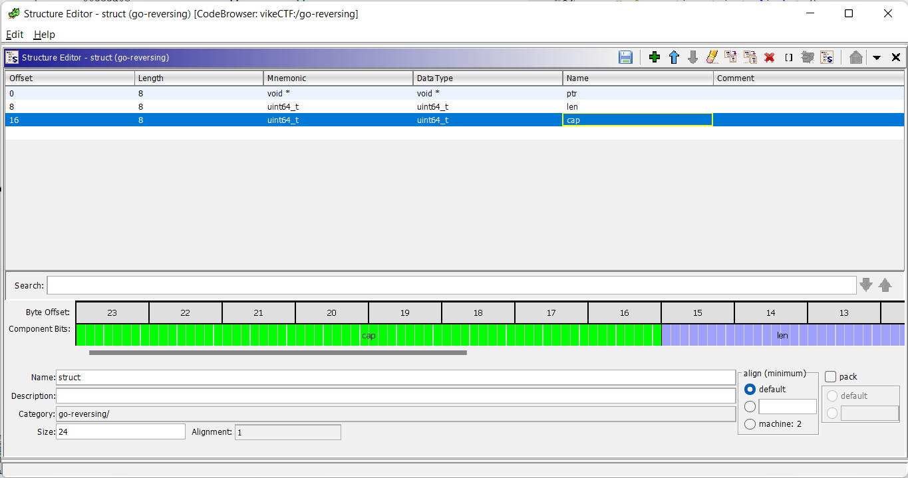
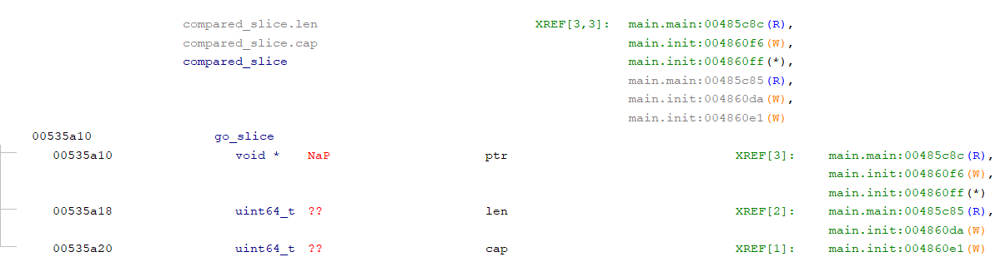
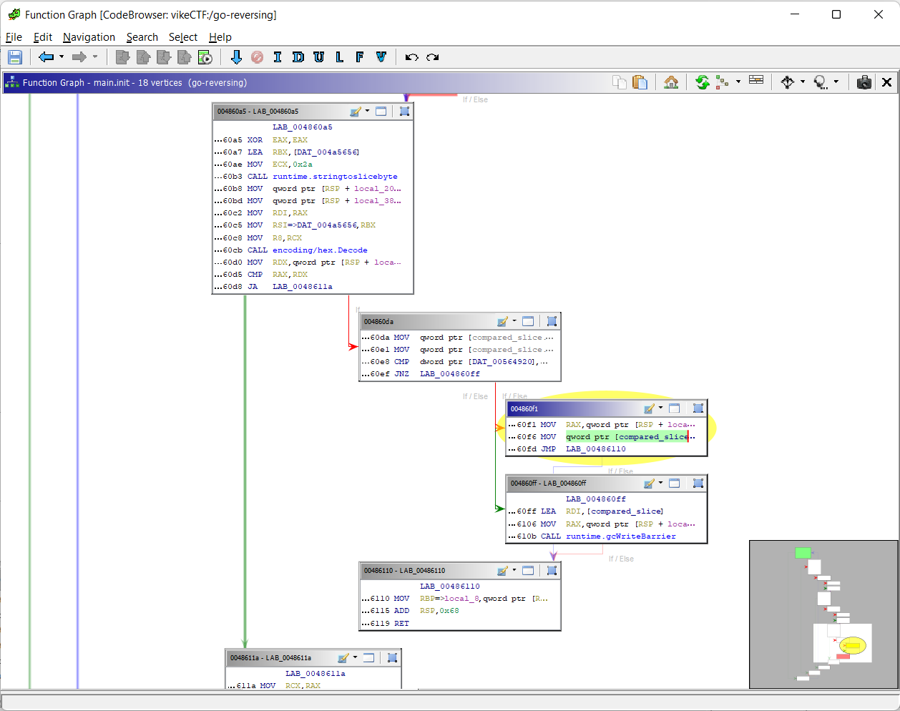

# Dig Deep

**Author: [`Malcolm Seyd`](https://github.com/malcolmseyd)**

**Category: `Reverse Hard`**

## Description

During our travels, we encounter a cute viking gopher! She keeps the flag safe and sound in her burrow. She won't let you see it, but she'll tell you if your guesses are right or wrong. It may seem like she hasn't given you much to work with, but you'll have to dig deep if you want to recover what has been lost.

## Organizers

Set your working directory to `./src`. You should have `docker` and `tar` installed. Note that unless your user has Docker permissions, you should run the following commands as root.

To build, run `./build.sh`. This will create a Docker image and compile `challenge`

To clean, run `./clean.sh`. This will delete the Docker image and `challenge` binary.

## Solution

<details> 
  <summary><b>TLDR:</b> Spoiler Warning</summary>

> Use [this script](https://github.com/getCUJO/ThreatIntel/blob/master/Scripts/Ghidra/go_func.py) to restore function symbols. Go uses an [internal ABI](https://go.googlesource.com/go/+/refs/tags/go1.19.7/src/cmd/compile/abi-internal.md), you'll need to know it to understand the assembly. We can use Go's [docs](https://pkg.go.dev/std) and [source code](https://cs.opensource.google/go) to recover what functions do from their names.  
> The input is encrypted with an unauthenticated ChaCha20 stream cipher and compared to a ciphertext. The key, nonce and expected ciphertext are stored as hex and decoded in `main.init`
> We solve by decrypting the ciphertext with the given key and nonce.

</details>

We check with `file` and discover it's a stripped Go binary. We can confirm with the Go compiler:

```console
$ go version challenge
challenge: go1.19.7
```

Hmm, how do we tackle this? A Google search gets us this:

https://www.google.com/search?q=reversing+stripped+go+binaries  
https://cujo.com/reverse-engineering-go-binaries-with-ghidra/

They have scripts that can automatically recover function names, cool!

Download the scripts
https://github.com/getCUJO/ThreatIntel/tree/master/Scripts/Ghidra

Open Ghidra and run analysis on the binary. Import `go_func.py` from the link above and run it on the binary to recover the function names. Unfortunately `type_extract.py` was broken on my machine, so I didn't bother running it.

Let's go to `main.main`. We can't read the C decompiler view because Go uses an internal ABI, so the decompiler doesn't have an understanding of how the program works. We're going to have to rely on the assembly listing from here-on out.

Here's a link to the ABI for Go 1.19.7:
https://go.googlesource.com/go/+/refs/tags/go1.19.7/src/cmd/compile/abi-internal.md

What we learn from this:

- Common types are larger than 1 word
  - Strings are 2 words: pointer, length
  - Slices are 3 words: pointer, length, capacity
  - Interfaces are 2 words: pointer to runtime info "itab", pointer to data
- Function parameters use different registers than C (on AMD64, it's `RAX, RBX, RCX, RDI, RSI, R8, R9, R10, R11`)
- Functions use the same registers to return data
- Values that are larger than 1 word use multiple registers (i.e. a string uses `RAX` for the pointer and `RBX` for the length)

Let's jump into it. We have a bunch of prints at the start of main, let's practice our Go reversing skills by recovering the strings.

`RAX` has a pointer, and `RBX` has a number literal. If we go to the pointer in `RAX` and set the type to `char[N]` where N is the number in RBX, we get a string. For example, the second print points the string: "I am the viking gopher, and I keep the flag in my burrow." Below, is the assembly listing after typing the pointer.

```asm
LEA        RAX ,[s_I_am_the_viking_gopher,_and_I_ke_004a6b  = "I am the viking gopher, and I
MOV        EBX ,0x3a
CALL       runtime.printstring                              undefined runtime.printstring(un
```

Now that we have some practice, let's get a high-level overview of main by looking up the function signatures and pasting them above their usages.

We call `io.ReadAll` on an io.Reader and pass the resulting byte slice directly to `main.encrypt`. We then compare two pointers with `runtime.memequal`. If It's false, we jump to one branch and print out a failure message, and if it's true, we jump to the other branch and print out a success message. So at a high level, we're reading from IO, passing the data to `main.encrypt`, and then comparing some pointers to see if the flag is correct.

```asm
CALL       main.encrypt                                     undefined main.encrypt(undefined
MOV        RCX ,qword ptr [DAT_00535a18 ]                    = ??
MOV        RDX ,qword ptr [DAT_00535a10 ]                    = ??
CMP        RBX ,RCX
JZ         LAB_00485c9c
XOR        EAX ,EAX
JMP        LAB_00485ca7
0485c9c                                    XREF[1]:     00485c96 (j)
MOV        RBX ,RAX
MOV        RAX ,RDX
memequal(a, b unsafe.Pointer, size uintptr) bool
CALL       runtime.memequal                                 undefined runtime.memequal()
```

We can start by getting the data in one of those pointers passed to `runtime.memequal`. You can see that we load two adjacent addresses out of the data section into RCX and RDX and then compare them with returned values from `main.encrypt`. Let's jump to these values and see where they're initialized.

```asm
                     DAT_00535a10                       XREF[3]:     main.main:00485c8c (R) ,
                                                                     main.init:004860f6 (W) ,
                                                                     main.init:004860ff (*)
00535a10                 undefine   ??
                     DAT_00535a18                       XREF[2]:     main.main:00485c85 (R) ,
                                                                     main.init:004860da (W)
00535a18                 undefine   ??
                     DAT_00535a20                       XREF[1]:     main.init:004860e1 (W)
00535a20                 ??         ??
```

This looks like a byte slice, since its 3 words right beside each other, surrounded by undefined memory. Let's create a struct in Ghidra using the Data Manager window.



And we can now apply this type to our data. This should make other code easier to read. Let's rename it to `compared_slice`. If we look at the code listing above, we see that on the right, and head to `main.init` to investigate what it's getting assigned. In the figure below, note the XREF's on `compared_slice` at the top. Double-click on the one with the yellow `W` for "write" and it'll take you to where it's written to in `main.init`.



We need to trace backwards a bit to see what's happening. Let's open up the Function Graph window. I've highlighted where our slice is being assigned its pointer.



If we trace execution from the first block, then at a high level we can see the control flow is this:

1. Pass some static data to `runtime.stringtobyteslice`
2. Decode the slice with `hex.Decode`
3. Store the slice in our `compared_slice` thing from earlier.

Let's pull out that string. We have the pointer in RBX and length in RCX at the top of the last picture. We get:

```asm
                     s_7e5ae14402415bf3abd6f9bd2c41e04f_004a5656     XREF[2]:     main.init:004860a7 (*) ,
                                                                                  main.init:004860c5 (*)
004a5656 37  65  35       char[42]   "7e5ae14402415bf3abd6f9bd2c41e04fa0bef6afcd"
         61  65  31
         34  34  30

```

If we zoom out, we see that this same chunk of code repeats three times. Let's repeat this, naming the slices `bytes_one` and `bytes_two` from top to bottom. We now know what three global variables are!

Now that we've got that figured out, let's go back to main. The only unexplored function is `main.encrypt` so let's go there. Before we enter, recall from earlier that we pass a slice to it, so RAX, RBX, and RCX will have ptr, len, and cap values.

The function body is filled with made-up parameters from Ghidra's best guess, so let's go to the function definition and rename the parameters to the registers that they represent like so:

```asm
                undefined  main.encrypt (undefined  RDI , undefined  RSI , un
undefined         AL:1           <RETURN>
undefined         DIL:1          RDI
undefined         SIL:1          RSI
undefined         DL:1           RDX
undefined         CL:1           RCX
undefined         R8B:1          R8
undefined         R9B:1          R9
undefined8        Stack[0x8]:8   stack_8                                 XREF[2]:     00485df6 (W) ,
                                                                                      00485f0c (R)
undefined8        Stack[0x10]:8  stack_10                                XREF[2]:     00485dee (W) ,
                                                                                      00485f14 (R)
undefined8        Stack[0x18]:8  stack_18                                XREF[2]:
```

Okay, let's get started. Right away the function starts putting the registers on the stack, so let's rename them to input_ptr, input_len, and input_cap:

```asm
MOV        qword ptr [RSP  + input_cap ],RCX
MOV        qword ptr [RSP  + input_len ],RBX
MOV        qword ptr [RSP  + input_ptr ],RAX
```

It also loads `bytes_one` and `bytes_two` into registers and assigns their fields to various local variables that I'll name it similarly to `input`.

Our next function is `golang.org/x/crypto/chacha20.newUnauthenticatedCipher`. Note that the first letter of the function is lowercase, so we're actually dealing with a private function here. Let's look it up on [Google codesearch](https://cs.opensource.google/search?q=chacha20.newUnauthenticatedCipher).

We find the private function and a similarly named public wrapper function. Here are the relevant parts:

```go
func NewUnauthenticatedCipher(key, nonce []byte) (*Cipher, error) {
	// This function is split into a wrapper so that the Cipher allocation will
	// be inlined, and depending on how the caller uses the return value, won't
	// escape to the heap.
	c := &Cipher{}
	return newUnauthenticatedCipher(c, key, nonce)
}

func newUnauthenticatedCipher(c *Cipher, key, nonce []byte) (*Cipher, error) {
  // snip
}
```

If we recall the order of our parameters in the calling convention, the following assembly makes sense. Like the code suggested above, it seems that the public function was inlined.

```asm
;; allocate a cipher.Cipher and put a pointer in parameter one
LEA        RAX ,[cipher_type ]                               = B0h
CALL       runtime.newobject                                undefined runtime.newobject(unde
;; assign bytes_one to parameter two (key)
MOV        RBX ,qword ptr [RSP  + bytes_one_ptr ]
MOV        RCX ,qword ptr [RSP  + bytes_one_len ]
MOV        RDI ,qword ptr [RSP  + bytes_one_cap ]
;; assign bytes_two to parameter three (nonce)
MOV        RSI ,qword ptr [RSP  + bytes_two_ptr ]
MOV        R8,qword ptr [RSP  + bytes_two_len ]
MOV        R9,qword ptr [RSP  + byte_two_cap ]
CALL       golang.org/x/crypto/chacha20.newUnauthenticate   undefined golang.org/x/crypto/ch
;; assign return value to a new variable which we name cipher_ptr
MOV        qword ptr [RSP  + cipher_ptr ],RAX
```

So we know that bytes_one is the key, and bytes_two is the nonce! Let's keep going, this is where it gets good.

The next function is `crypto/cipher.StreamWriter.Write`. Let's pull up the relevant types.

```go
// types:
// interface = {itab, *data}, 2 registers
// slice = {*data, len, cap}, 3 registers

type StreamWriter struct {
	S   Stream
	W   io.Writer
	Err error // unused
}

// Calling convention: RAX, RBX, RCX, RDI, RSI, R8, R9, R10, R11
func (w StreamWriter) Write(src []byte) (n int, err error)
// RAX, RBX = w.S: cipher.Stream (interface)
// RCX, RDI = w.W: io.Writer (interface)
// RSI, R8 = w.Err: error (interface)
// R9, R10, R11 = src: []byte (slice)
```

Again, we'll trace the registers back and give the variables appropriate names.

For example, we need to trace the path of our io.Writer throughout the function. We know that it ends up in RDI, so let's trace it up through the function. You might want to read this bottom to top. I'll leave the addresses in this listing so that you can follow if you'd like:

```asm
;; RDI came from RAX
00485f07  MOV        RDI ,RAX
00485f0a  XOR        RSI ,RSI
00485f0c  MOV        R9,qword ptr [RSP  + input_ptr ]
00485f14  MOV        R10 ,qword ptr [RSP  + input_len ]
00485f1c  MOV        R11 ,qword ptr [RSP  + input_cap ]
00485f24  MOV        RAX ,RCX
00485f27  MOV        RCX =>output_writer_itab ,RDX                     = 004925a0
00485f2a  CALL       crypto/cipher.StreamWriter.Write                 undefined crypto/cipher.StreamWr

;; scrolling up to where RAX was last assigned...

;; we allocate something to RAX and store it on the stack
;; let's name it output_ptr
00485e7e  LEA        RAX ,[output_type ]                               = 28h    (
00485e85  CALL       runtime.newobject                                undefined runtime.newobject(unde
00485e8a  MOV        qword ptr [RSP  + output_ptr ],RAX
```

If we go to after `crypto/cipher.StreamWriter.Write`, we can trace output_ptr to RAX at the end of the function. I don't really understand what happens here, but basically, we end put returning a modified pointer to to output_ptr.

```asm
CALL       crypto/cipher.StreamWriter.Write                 undefined crypto/cipher.StreamWr
;; move output_ptr to RCX
MOV        RCX ,qword ptr [RSP  + output_ptr ]
MOV        RBX ,qword ptr [RCX  + 0x8 ]
;; move output_ptr to RDX
MOV        RDX ,qword ptr [RCX ]
MOV        RSI ,qword ptr [RCX  + 0x10 ]
MOV        RAX ,qword ptr [RCX  + 0x18 ]
CMP        RAX ,RBX
JA         LAB_00485f6e
SUB        RSI ,RAX
SUB        RBX ,RAX
MOV        RCX ,RSI
NEG        RSI
SAR        RSI ,0x3f
AND        RAX ,RSI
;; add RDX to RAX
ADD        RAX ,RDX
MOV        RBP =>local_8 ,qword ptr [RSP  + 0xb8 ]
ADD        RSP ,0xc0
RET

```

Let's review which pieces of the puzzle we have.

- main.encrypt takes in a []byte, and returns a []byte
- main.encrypt encrypts the input []byte with key=bytes_one and nonce=bytes_two
- The return value of main.encrypt is compared with a hardcoded ciphertext.
- The key, nonce, and ciphertext are stored as hex encoded strings and decoded at runtime.

With all of those pieces, let's put them together and write a solver:

```go
package main

import (
	"crypto/cipher"
	"encoding/hex"
	"os"

	"golang.org/x/crypto/chacha20"
)

func main() {
	key, _ := hex.DecodeString("c2bb203e9044faa598537d288edb50b791046233b717155432458b3c2c3865db")
	nonce, _ := hex.DecodeString("010203040506070809101112")
	ciphertext, _ := hex.DecodeString("7e5ae14402415bf3abd6f9bd2c41e04fa0bef6afcd")

	c, _ := chacha20.NewUnauthenticatedCipher(key, nonce)
	sw := cipher.StreamWriter{S: c, W: os.Stdout}
	sw.Write(ciphertext)
}
```

Download and run our dependencies:

```console
$ go mod download golang.org/x/crypto
go: module golang.org/x/crypto: not a known dependency
$ go get golang.org/x/crypto/chacha20
go: added golang.org/x/crypto v0.7.0
go: added golang.org/x/sys v0.6.0
$ go run solver.go
vikeCTF{ilovegolang!}
```

And there we have it!

## Flag

```
vikeCTF{ilovegolang!}
```
