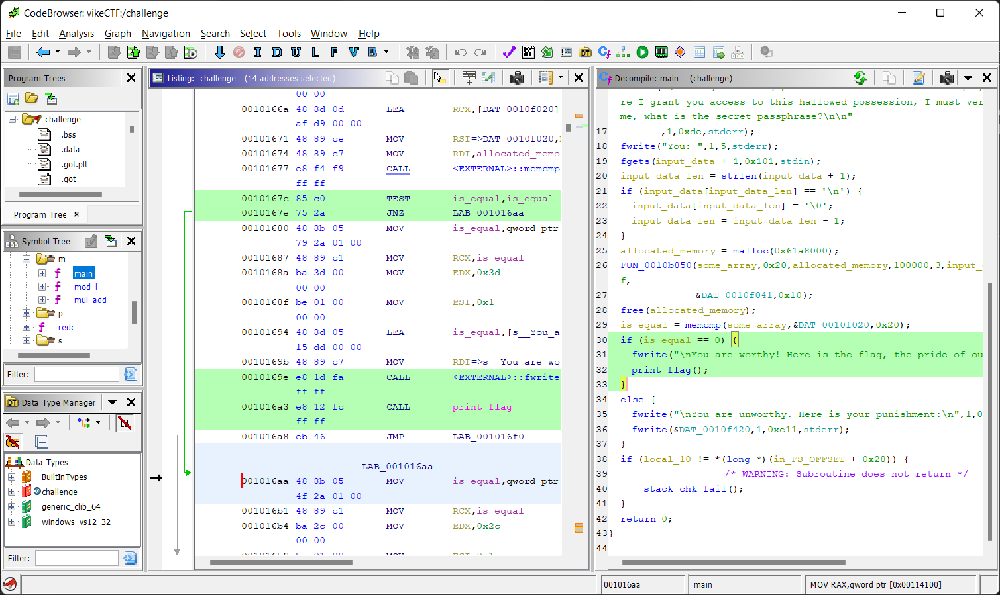

# Gunnar the Gatekeeper

**Author: [`Malcolm Seyd`](https://github.com/malcolmseyd)**

**Category: `Reverse Medium`**

## Description

Ah, the mighty Gunnar the Gatekeeper! He welcomes you to his land, but he is unsure if you are worthy to have the sacred flag. Discover the secret to unlock access to this most prized possession.

## Organizers

You should have `make`, `strip`, and `gcc` installed. To build, simply run `make`:

```console
$ make
gcc -pedantic -Wall -Wextra -march=native -O0 -o challenge challenge.c monocypher.o
strip -w -K "*" -K '!crypto_*' -K '!blake2b_*' -K '!chacha20*' -K '!*kdf*' -K "!flag_ciphertext" -K "!flag_*" -K "!*.c" challenge
```

You can now distribute `challenge`.

To change the flag, you need to open `challenge.c` and change `flag`. Then, uncomment the encryption code and get the program to write the ciphertext and MAC to stdout. Put the hex values in the `flag_ciphertext` and `flag_mac` variables and test the program.

### Imports

This project uses Monocypher, which is licensed as CC-0. I've included the object and header file in this repo.

You can download Monocypher from here:  
https://monocypher.org/download/monocypher-3.1.3.tar.gz

## Solution

<details> 
  <summary><b>TLDR:</b> Spoiler Warning</summary>

> Patch the `JNZ` instruction to `JZ` for `memcmp(some_array,&DAT_0010f020,0x20)` to bypass the static check.

</details>

We start with a single file, `challenge`. Let's see what the file is:

```console
$ file challenge
challenge: ELF 64-bit LSB pie executable, x86-64, version 1 (SYSV), dynamically linked, interpreter /lib64/ld-linux-x86-64.so.2, BuildID[sha1]=e6283107c251325de54b7e76030d2fdcbef15d3b, for GNU/Linux 4.4.0, not stripped
```

First, let's run the program:

```console
$ ./challenge
          __     __
         / < ___ > \
         '-._____.-'
          ,| ^_^ |,
           ((())))
             | |
        ,############\
       /  #########,  \
      /_<'#########'./_\
     '_7_ ######### _o_7
      (  \[o-o-o-o]/  )
       \|l#########l|/                 __,'
          ####_####                 ,-'  ,'
         /    |    \             .-'  ;  |_
~~~~~~~~~|    |    |~~~~~~~~~~~~/_,-./  -._
         |_  _|_  _|       ~~ ~   '--.____.
  ~ ~    |\\//|\\//|             ~ ~~  ~
         \//\\|//\\/   ~ ~~~~
       ___\\// \\//___
      (((___X\ /X___)))

Viking: Greetings, traveler! I am Gunnar the Mighty, defender of this sacred flag. Before I grant you access to this hallowed possession, I must verify that you are indeed worthy. Tell me, what is the secret passphrase?

You: i dont know

You are unworthy. Here is your punishment:
⣿⣿⣿⣿⣿⣿⣿⣿⣿⣿⣿⣿⣿⣿⣿⣿⣿⣿⣿⣿⡿⠿⠿⠿⠛⠿⣿⣿⣿⣿⣿⣿⣿⣿⣿⣿⣿⣿⣿⣿⣿⣿
⣿⣿⣿⣿⣿⣿⣿⣿⣿⣿⣿⣿⣿⣿⣿⣿⣿⡉⠁⠈⠁⠀⠀⠀⠀⠀⠀⠈⠹⣿⣿⣿⣿⣿⣿⣿⣿⣿⣿⣿⣿⣿
⣿⣿⣿⣿⣿⣿⣿⣿⣿⣿⣿⣿⣿⣿⣿⣿⣿⡇⠀⠀⠀⠀⠀⠀⣀⣀⡀⠀⠀⢸⣿⣿⣿⣿⣿⣿⣿⣿⣿⣿⣿⣿
⣿⣿⣿⣿⣿⣿⣿⣿⣿⣿⣿⣿⣿⣿⣿⣿⡿⣿⣾⣾⣷⣾⣿⣿⣿⣿⣿⡆⠀⢸⣿⣿⣿⣿⣿⣿⣿⣿⣿⣿⣿⣿
⣿⣿⣿⣿⣿⣿⣿⣿⣿⣿⣿⣿⣿⣿⣿⣿⡀⣿⡿⠿⠿⣿⣿⣿⣿⣿⣿⡇⠀⣼⣿⣿⣿⣿⣿⣿⣿⣿⣿⣿⣿⣿
⣿⣿⣿⣿⣿⣿⣿⣿⣿⣿⣿⣿⣿⣿⣿⣿⣷⣿⡆⠀⠀⢹⣿⣷⣚⣿⣿⣿⢸⣿⣿⣿⣿⣿⣿⣿⣿⣿⣿⣿⣿⣿
⣿⣿⣿⣿⣿⣿⣿⣿⣿⣿⣿⣿⣿⣿⣿⣿⣿⣿⣿⣯⣿⣿⣿⣿⣿⣿⣿⣿⣿⣿⣿⣿⣿⣿⣿⣿⣿⣿⣿⣿⣿⣿
⣿⣿⣿⣿⣿⣿⣿⣿⣿⣿⣿⣿⣿⣿⣿⣿⣿⣿⣿⣽⡂⣨⣿⣿⣿⣿⣿⣿⣿⣿⣿⣿⣿⣿⣿⣿⣿⣿⣿⣿⣿⣿
⣿⣿⣿⣿⣿⣿⣿⣿⣿⣿⣿⣿⣿⣿⣿⣿⣿⣿⣿⣿⡏⠉⠉⣻⣿⣿⣿⣿⣿⣿⣿⣿⣿⣿⣿⣿⣿⣿⣿⣿⣿⣿
⣿⣿⣿⣿⣿⣿⣿⣿⣿⣿⣿⣿⣿⣿⣿⣿⣿⣿⣿⣿⣇⡀⢳⣿⣿⣏⣿⣿⣿⣿⣿⣿⣿⣿⣿⣿⣿⣿⣿⣿⣿⣿
⣿⣿⣿⣿⣿⣿⣿⣿⣿⣿⣿⣿⣿⣿⣿⡿⠛⢹⣿⠀⠁⠉⠹⣿⣿⡗⢻⣿⡿⢿⣿⣿⣿⣿⣿⣿⣿⣿⣿⣿⣿⣿
⣿⣿⣿⣿⣿⣿⣿⣿⣿⣿⣿⠿⠛⠉⠁⠀⠀⠀⢷⣤⡀⠀⠀⢻⣿⡇⡵⠿⣷⠀⠀⠉⠉⠛⠻⠿⣿⣿⣿⣿⣿⣿
⣿⣿⣿⣿⣿⣿⣿⡿⠟⠋⠀⠀⠀⠀⠀⠀⠀⠀⢸⣿⣷⣿⣶⣾⣿⣿⣻⣿⣿⠀⠀⠀⠀⠀⠀⠀⠈⠙⠻⣿⣿⣿
⣿⣿⣿⣿⣿⠋⠁⠀⠀⠀⠀⠀⠀⠀⠀⠀⠀⠀⢸⣿⣿⣿⣿⣿⣿⣿⣿⣿⡏⠀⠀⠀⠀⠀⠀⠀⠀⠀⠀⢸⣿⣿
⣿⣿⣿⣿⡇⠀⠀⠀⠀⠀⠀⠀⠀⠀⠀⠀⠀⠀⠈⠛⢻⣍⣛⡛⠛⢻⣿⣿⠄⠀⠀⠀⠀⠀⠀⠀⠀⠀⠀⠘⣿⣿
⣿⣿⣿⣿⠃⠀⠀⠀⠀⠀⠀⠀⠀⠀⠀⠀⠀⠀⠀⠀⠰⠶⠿⠯⣭⣭⣟⣏⡁⠀⠀⠀⠀⠀⠀⠀⠀⠀⠀⠀⣿⣿
⣿⣿⣿⣿⠀⠀⠀⠀⠀⠀⠀⠀⠀⠀⠀⠀⠀⠀⠀⠀⠈⣛⣛⣶⠶⠶⡇⠬⢍⠀⠀⠀⠀⠀⠀⠀⠀⠀⠀⠀⣿⣿
⣿⣿⣿⡟⠀⠀⠀⠀⠀⠀⠀⠀⠀⠀⠀⠀⠀⠀⠀⠀⠀⣭⣭⣭⣟⣛⡃⠒⠂⠀⠀⠀⠀⠀⠀⠀⠀⠀⠀⠀⣿⣿
⣿⣿⣿⡇⠀⠀⠀⠀⠀⠀⠀⠀⠀⠀⠀⠀⠀⠀⠀⠀⠀⠰⠶⠦⣤⣭⡇⣉⠙⠓⠀⠀⠀⠀⠀⠀⠀⠀⠀⢀⣿⣿
⣿⣿⣿⠃⠀⠀⠀⠀⠀⠀⠀⠀⠀⠀⠀⠀⠀⠀⠀⠀⠀⢘⣛⣓⡲⠶⠆⠤⠬⠍⠀⠀⠀⠀⠀⠀⠀⠀⠀⢸⣿⣿
⣿⣿⡟⠀⠀⠀⠀⠀⠀⠀⠀⠀⠀⠀⠀⠀⠀⠀⠀⠀⠀⠀⢭⣍⣉⣉⢀⠂⠀⠂⠀⠀⠀⠀⠀⠀⠀⠀⠀⢸⣿⣿
⣿⣿⠁⠀⠀⠀⠀⠀⠀⠀⠀⠀⠀⠀⠀⠀⠀⠀⠀⠀⠀⠀⠒⠲⠦⠤⠰⠈⠀⠀⠀⠀⠀⠀⠀⠀⠀⠀⢀⣰⣿⣿
⣿⣿⠀⠀⠀⠀⠀⠀⠀⠀⠀⠀⠀⠀⠀⠀⠀⠀⠀⠀⠀⠀⣙⣛⠓⠒⠀⠀⠀⠀⠀⠀⠀⠀⠀⠀⠀⠀⠸⣿⣿⣿
⣿⣿⠀⠀⠀⠀⠀⠀⠀⠀⠀⠀⠀⠀⠀⠀⠀⠀⠀⠀⠀⠀⠦⠠⠀⠈⠈⠉⠀⠀⠀⠀⠀⠀⠀⠀⠀⠀⠀⢹⣿⣿
⣿⠟⠀⠀⠀⠀⠀⠀⠀⠀⠀⠀⠀⠀⠀⠀⠀⠀⠀⠀⠀⠀⠀⠀⠀⠀⠀⠀⠀⠀⠀⠀⠀⠀⠀⠀⣀⣤⣦⣼⣿⣿
⣇⠀⠀⠀⠀⠀⠀⠀⠀⠀⠀⠀⠀⠀⠀⠀⠀⠀⠀⠀⠀⠀⠀⠀⠀⠀⠐⠀⠀⠀⠀⠀⠀⠀⠀⠀⣽⣿⣿⣿⣿⣿
⣿⣧⡀⠀⠀⠀⠀⠀⠀⠀⠀⠀⠀⠀⠀⠀⠀⠀⠀⠀⠀⠀⠀⠀⠀⢠⢀⠀⠀⠀⠀⠀⠀⠀⠀⠀⣿⣿⣿⣿⣿⣿
⣿⣿⣷⡀⠀⠀⠀⠀⠀⠀⠀⠀⣀⠀⠀⠀⠀⠀⠀⠀⠀⠀⣤⣤⣤⣾⢸⣠⡀⠀⠀⠀⠀⠀⠀⠀⠘⢿⣿⣿⣿⣿

https://www.youtube.com/watch?v=dQw4w9WgXcQ
```

Well darn, we got rickrolled. It looks like the program wants a password before it'll give us the flag.

Let's open it up in Ghidra. The binary isn't stripped so let's go to `main`. I'll rename variables as I find them to make the code easier to read.

```c
fgets(input_data + 1,0x101,stdin);
input_data_len = strlen(input_data + 1);
if (input_data[input_data_len] == '\n') {
    input_data[input_data_len] = '\0';
    input_data_len = input_data_len - 1;
}
```

We start by reading data from stdin and chopping a newline off the end if possible.

```c
allocated_memory = malloc(0x61a8000);
FUN_0010b850(some_array,0x20,allocated_memory,100000,3,input_data + 1,input_data_len & 0xffffffff ,
            &DAT_0010f041,0x10);
free(allocated_memory);
```

We allocate some memory, pass it to some function, and free the memory. We also pass an array that we haven't seen yet.

```c
is_equal = memcmp(some_array,&DAT_0010f020,0x20);
if (is_equal == 0) {
    fwrite("\nYou are worthy! Here is the flag, the pride of our people:\n\n",1,0x3d,stderr);
    print_flag();
}
else {
    fwrite("\nYou are unworthy. Here is your punishment:\n",1,0x2c,stderr);
    fwrite(&DAT_0010f420,1,0xe11,stderr);
}
```

We then compare that array to some static data and print the flag if it matches.

It looks like `print_flag()` has no parameters, so we can assume that, if we can get it to run, we will get the flag. Luckily for us, this program is on our computer, and we can do whatever we want to it, including modifying it.

`print_flag()` is only called when we can get `is_equal` to equal 0. Let's see what the assembly for checking that looks like. We can find the assembly by highlighting the line in the C view like so:



We can see that the `TEST` and `JNZ` instructions jump to the else condition if `is_equal` is not zero. If it is zero, we keep going and print the flag.

Instead of printing the flag on the right password, what if we patch the program to print the flag on the _wrong_ password!

Right-click on the `JNZ`, click "Patch Instruction", change it to `JZ`, and press enter. Right away, we can see in the C view that the if and else conditions swapped places. The code is now:

```c
is_equal = memcmp(some_array,&DAT_0010f020,0x20);
if (is_equal == 0) {
    fwrite("\nYou are unworthy. Here is your punishment:\n",1,0x2c,stderr);
    fwrite(&DAT_0010f420,1,0xe11,stderr);
}
else {
    fwrite("\nYou are worthy! Here is the flag, the pride of our people:\n\n",1,0x3d,stderr);
    print_flag();
}
```

Cool! So it should print the flag on a wrong answer. Let's export as an ELF using File > Export Program.

Put your program in a Linux environment and run it. Give it any wrong answer, and it should print the flag!

## Flag

```
vikeCTF{p4tC#_m3_l1k3_1_0F_uR_fR3Nc#_g1r!s}
```
